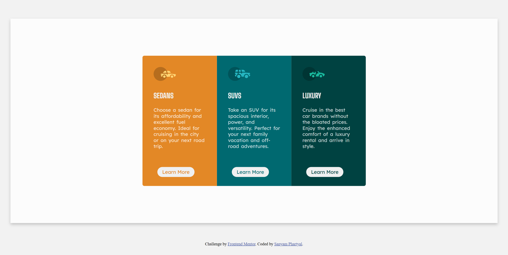
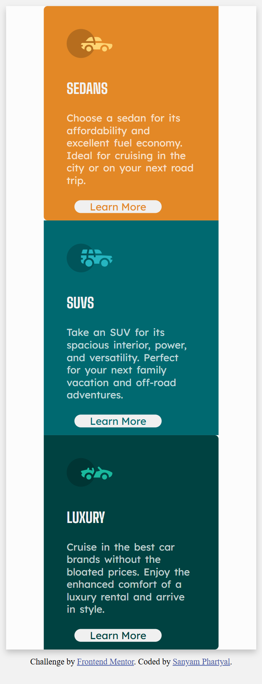

# Frontend Mentor - 3-column preview card component solution

This is my solution to the [3-column preview card component challenge on Frontend Mentor](https://www.frontendmentor.io/challenges/3column-preview-card-component-pH92eAR2-). This challenge helped me practice HTML and CSS layout skills and build a responsive component.

---

## Table of contents

- [Overview](#overview)
  - [The challenge](#the-challenge)
  - [Screenshot](#screenshot)
  - [Links](#links)
- [My process](#my-process)
  - [Built with](#built-with)
  - [What I learned](#what-i-learned)
- [Author](#author)

---

## Overview

### The challenge

Users should be able to:

- View the optimal layout depending on their device's screen size
- See hover states for interactive elements

### Screenshot





### Links

- **Solution URL:** [GitHub Repository](https://github.com/Sanyam2511/3-column-preview-card)
- **Live Site URL:** [Live Preview](https://sanyam2511.github.io/3-column-preview-card/)

---

## My process

### Built with

- Semantic **HTML5** markup
- **CSS3**
- **Flexbox**
- **Responsive design** principles
- **Mobile-first workflow**

### What I learned

While building this component, I improved my understanding of:

- Responsive design using Flexbox
- Layout alignment using `display: flex`
- Using `:hover` pseudo-classes for better interactivity

Example CSS snippet I used:

```css
.card-sedan{
    color:hsl(31, 77%, 52%);
}

.card-sedan:hover{
    background-color: hsl(31, 77%, 52%);
    color:white;
    border-style: solid;
    border-color: white;
}

## Author

- Website - [Sanyam Phartyal](https://sanyam2511.github.io/portfolio/)
- Frontend Mentor - [@Sanyam2511](https://www.frontendmentor.io/profile/Sanyam2511)
